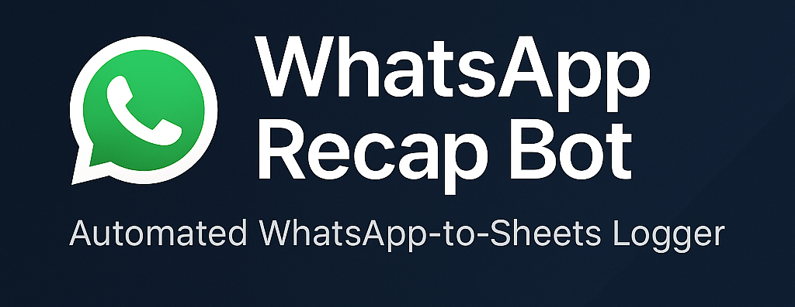

<p align="center">
  
</p>

# 📩 WhatsApp Recap Bot

Bot otomatis untuk mencatat permintaan dan feedback dari grup WhatsApp ke dalam Google Spreadsheet — **tanpa perlu copy-paste manual.**  
Dibangun menggunakan `whatsapp-web.js` dan integrasi `googleapis`.

---

## ✨ Fitur Utama

- ✅ Membaca pesan dari grup WhatsApp tertentu
- ✅ Mendeteksi pesan `request` dan `done`
- ✅ Mencatat log recap ke Google Sheet secara otomatis
- ✅ Tidak memerlukan interaksi manual setelah jalan
- ✅ Ringan dan berjalan di lokal / server pribadi

---

## 🛠️ Teknologi

- Node.js
- [whatsapp-web.js](https://github.com/pedroslopez/whatsapp-web.js)
- Google Sheets API
- LocalAuth session
- GitHub integration (auto-push project)

---

## 📦 Instalasi

```bash
git clone https://github.com/pixumi/wa-recap-bot.git
cd wa-recap-bot
npm install
